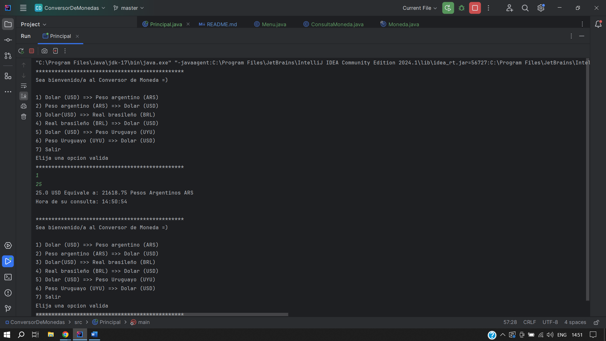
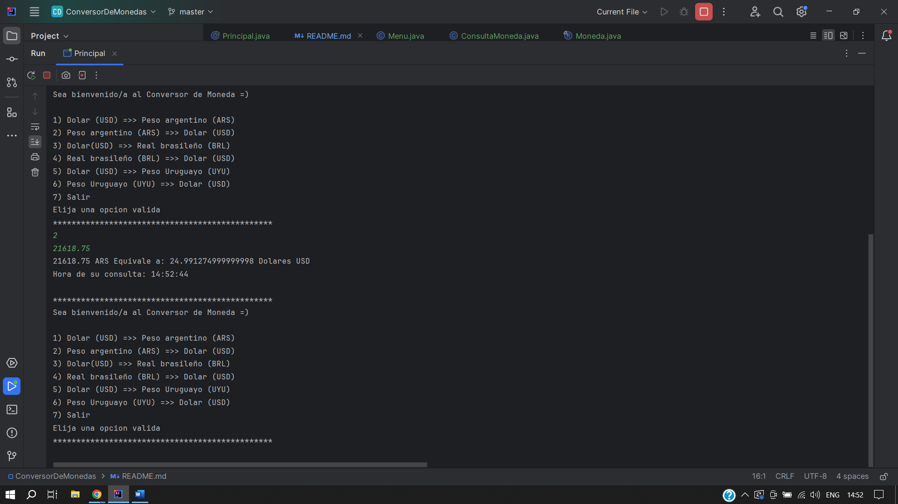
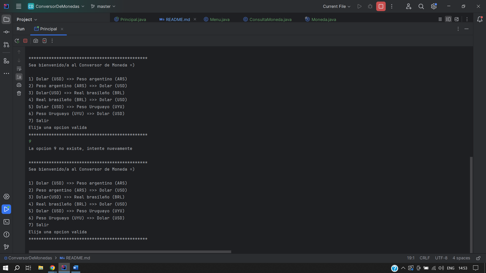
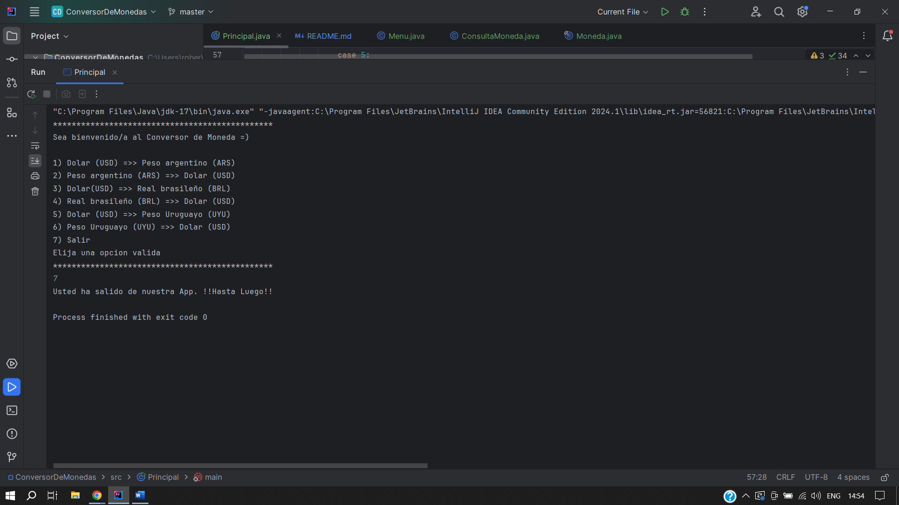

# Conversor de Monedas - Challenge Alura Latam & Oracle💱

¡Bienvenido al Conversor de Monedas! Esta aplicación te permite convertir entre diferentes monedas de una manera fácil y rápida utilizando la API de ExchangeRate-API.

## Características 🚀

- **Conversión rápida**: Convierte entre múltiples monedas, incluyendo USD, ARS, BRL y UYU.
- **Interfaz intuitiva**: Utiliza una interfaz de consola fácil de usar para realizar las conversiones.
- **Actualización en tiempo real**: Utiliza la API de ExchangeRate-API para obtener tasas de cambio actualizadas al momento de la conversión.

## Capturas de Pantalla 📸

Aquí tienes una vista previa de cómo se ve la aplicación en acción:









## Uso 🛠️

1. Clona este repositorio en tu máquina local.
2. Ejecuta la clase `Principal.java`.
3. Sigue las instrucciones en la consola para realizar tus conversiones de monedas.

```bash
java Principal.java
Requisitos Previos 📋
Java 8 o superior.
Conexión a Internet.
Tecnologías Utilizadas 🛠️
Java
Gson (para manejar datos JSON)
ExchangeRate-API
Créditos y Agradecimientos 🙏
Este proyecto utiliza la biblioteca Gson de Google para manejar datos JSON. Agradecemos a ExchangeRate-API por proporcionar un servicio gratuito y fácil de usar para obtener tasas de cambio actualizadas.

Contribución 💡
Si quieres contribuir a este proyecto, ¡no dudes en hacer un pull request! Estamos abiertos a sugerencias y mejoras.

Licencia 📄
Este proyecto está bajo la Licencia de RS.